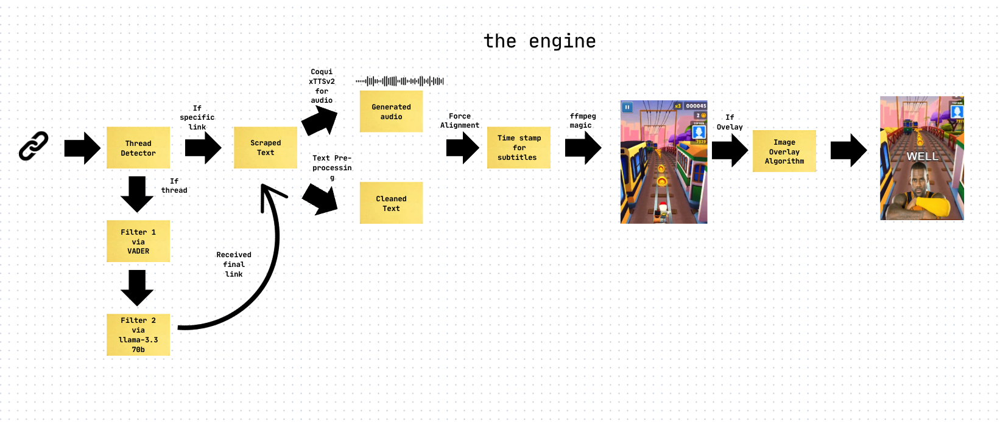

# Open Brain Rot 
 
<Created with Imagen 3>

## Updates:
Thank you everyone for the support so far albeit the r/learnmachinelearning community! In short here are some future updates I would be doing overtime
1. Readjusting the text and font
2. Adding k-ranking sentiments using VADER (A feature I would introduce in the later stages)
3. Adding parallel compute (Very much in the future)

### So i got extremely bored over the holidays and decided to just make a fun project to see if its possible to automate the kind of content i was seeing on TikTok

## A simple brain rot generator just by inserting your reddit url

## Example
[](https://youtube.com/shorts/CRhbay8YvBg)


## How it works 

### High Level Diagram


### Scraping 
Simple webscraping using Reddit's open source API, to collect the title and story based off the reddit website

### Voice Translation:
Using Coqui's xTTSv2 (which is super lightweight , portable and accurate), I converted the text into audio. Coqui's TTS audio also allows you to use sample audios, so I used the common-man's TikTok audio. 

### Pre-processing:
Removal of certain punctuations, special characters via RegEx before we carry out force alignment.

### On Force Alignment: 
The most important step to generate the video was the alignment between audio and text in order to get the subtitle. This was achieved using forced alignment. In this, we used wav2vec2 and base it all on Motu Hira's tutorial on Forced alignment with Wav2Vec2. It uses a frame-wise label probality from the audio (that is the voice that we generated), creates a trellis matrix representing the probability of labels aligned per time step before using the most likely path from the trellis matrix.

### ffpmeg Magic:
Once we got the audio, video sample as well as the timestamp text (which is in .ass format btw), we can then generate the video using some simple ffmpeg magic. This subprocess can be viewed under

``` video_generator.py ```

## How to run it
There are mainly 6 important scripts within this, each deliberately separated so that it can be easier to include any upgrades in the future (and what not)

### Pre-requisites:
1. PyTorch (with CUDA 12.4)
2. Conqui TTS ([Link](https://github.com/coqui-ai/TTS))
3. FFMpeg ([Link](https://www.ffmpeg.org/))

Afterwards, just run the script 

``` python main.py```

and you are good to go!

## Others:
### Why is there no requirements.txt? 
I installed the script on my personal venv so if i were to make a pip it would be very messy (and I am too lazy to do that)  ~ in general just follow the instructs on how to run it above and it should be good

### Are there any future updates?
So far , yes there are but it is to hopefully create website or gradio to make this more user friendly, and to hopefully create more brain rot videos in the future (i am looking at OpenSora but no plans as of now)


## Thanks:
I would like to thank Motu Hira for creatig this tutorial on Forced Alignment using Wav2Vec2. Without this, the subtitles would not be able to work (the original plan was to use CMUSphinx but the lack of community support made it difficult for me to work with)

Here is the original Tutorial if anyone is interested: 

[Link](https://pytorch.org/audio/main/tutorials/forced_alignment_tutorial.html)